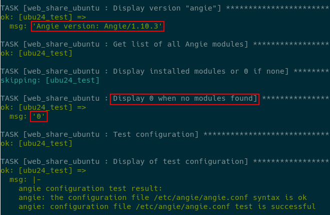
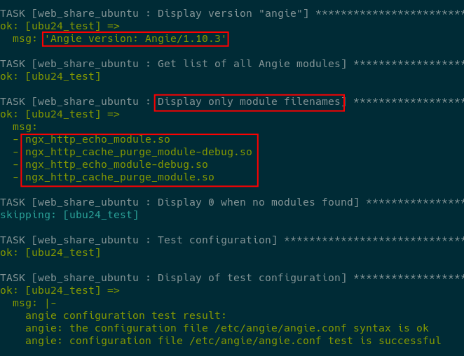
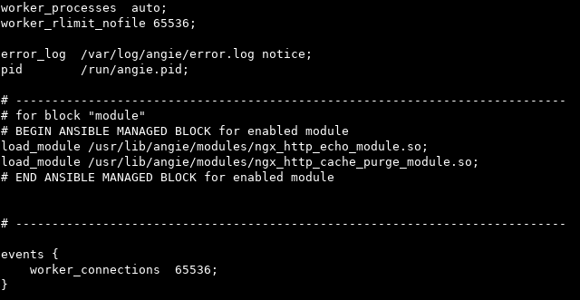
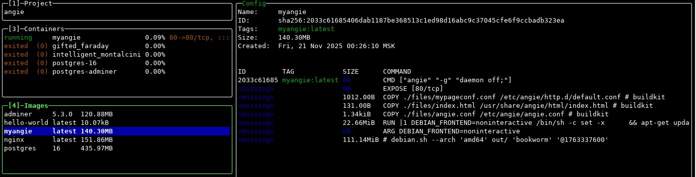
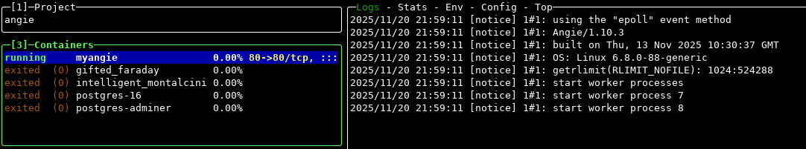
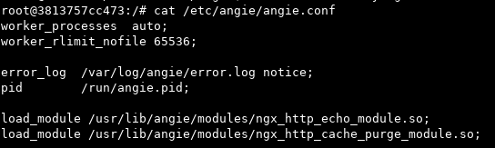
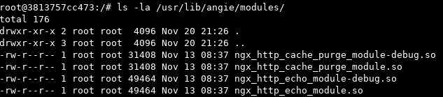
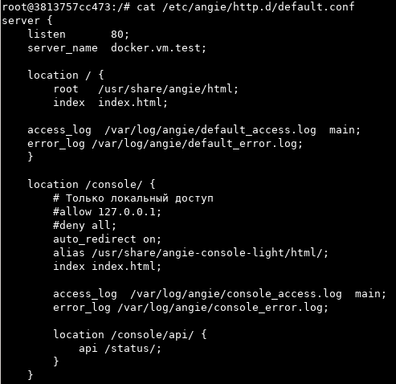
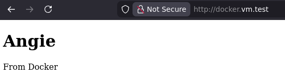
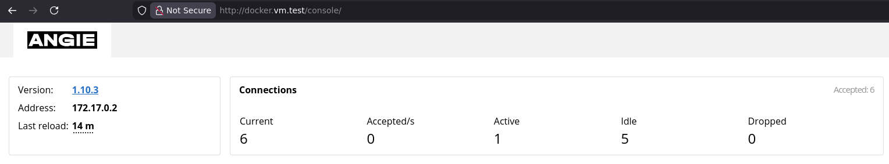

<h2> ДЗ по теме № 03 - Варианты установки Angie </h2>


<h3> 1. Установка Angie и несколько дополнительных модулей из репозитория </h3>

Была выполнена в 2 этапа: базовая и установка модулей.  
Использовалась ansible-роль [web_share_ubuntu](https://github.com/gruqo/completed_works/blob/main/ansible/roles/web_share_ubuntu/README.md)  

<br>

1.1. Для базовой установки использовалась команда:  
```
ansible-playbook <<ПУТЬ К ПЛЕЙБУКУ>> -t angie_instal
```
<br>

Отладочная информация при выполнении плейбука  

<br>

1.2. Для установки модулей использовалась команда:  
```
ansible-playbook <<ПУТЬ К ПЛЕЙБУКУ>> -t angie_mod
```
<br>

Настройка модулей для виртуальных хостов в конфигурационных файлах не проводилась.  
Были выбраны следующие модули:  
```
angie-module-echo
angie-module-cache-purge
```
<br>

Отладочная информация при выполнении плейбука  

<br>

Блок в ```/etc/angie/angie.conf``` для автоматизированного добавления списка модулей при уставновке,  
при генерации блока отфильтровывались модули с постфиксом ```-debug```  


<br>

---

<h3> 2. Запуск Angie из Docker-образа </h3>

Docker был установлен в ВМ, на локальном сервере студента.  
В локальной сети работает DNS-сервер,  
страницы были доступны по адресу ```http://docker.vm.test```  

Было опубликовано 2 эндпоинта:  
``` / ``` - для дефолтной страницы  
```/console/ ``` - для Console Light  

Дополнительно были установлены следующие модули  
```
angie-module-echo
angie-module-cache-purge
```
<br>

Мониторинг контейнера в lazydocker  


<br>

Часть конфигурации angie с загруженными модулями  

<br>

Установленные модули в контейнере  

<br>

Часть конфигурации виртуального хоста  

<br>

Веб: дефолтная страница  

<br>

Веб: Console Light   

<br>
