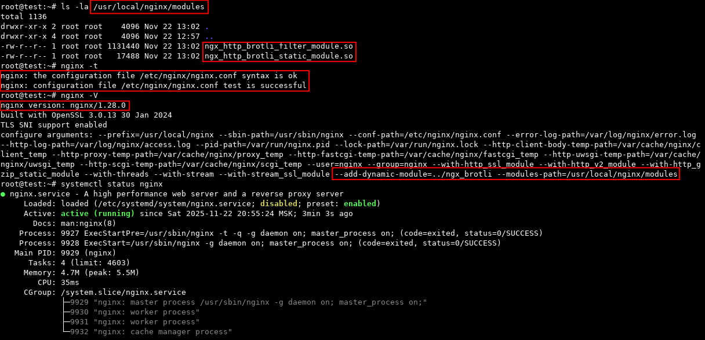
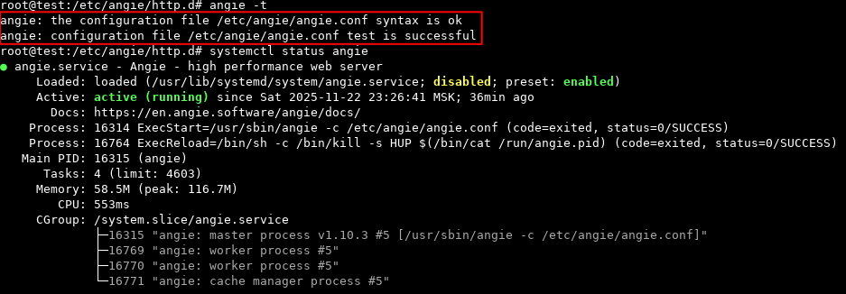
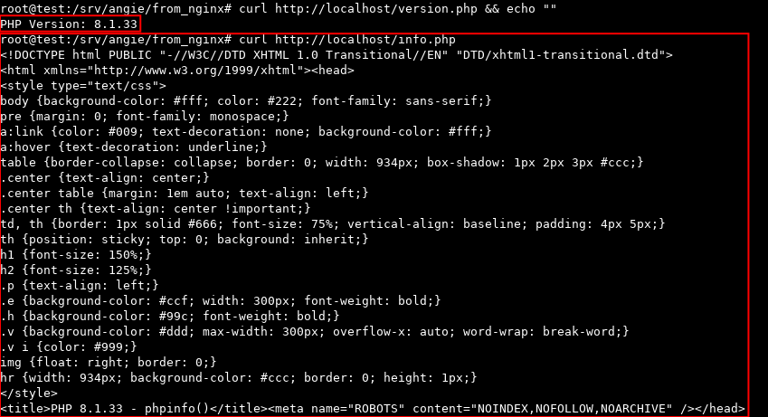

<h2> ДЗ по теме № 04 - Миграция с Nginx на Angie </h2>


<h3> 1. Подготовка </h3>

Для выполнения ДЗ с представленными конфигами, предварительно потребовалось:  
- провести анализ конфигов: по результату которого было принято решение о сборке Nginx c модулем ```brotli``` для проверки работоспособности конфигов  
- удалить установленный Nginx  
- собрать Nginx c динамическим модулем brotli  
- создать дополнительные директории и systemd-юнит для управления nginx, настроить права и доступы  
- установить ```php8.1.0-fpm```  
- добавить ```info.php``` и проверить доступность.  

Результаты предварительной работы:  


Проверка доступности и обработки php-файла ошибок не выявила.  

<br>

<h3> 2. Миграция </h3>

Перед миграцией была проведена ручная правка конфигов Angie.  
Проверка ```angie -t``` ошибок не выявила.  

Статус Angie после миграции работы:  

<br>

Проверка доступности ```info.php```:  

<br>
