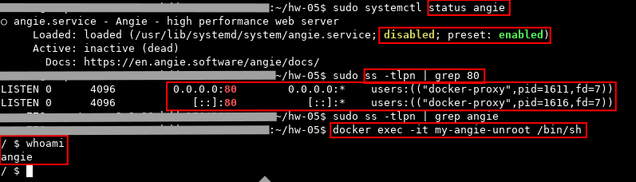
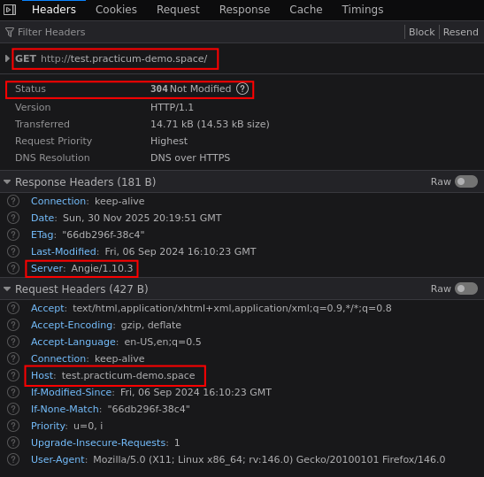
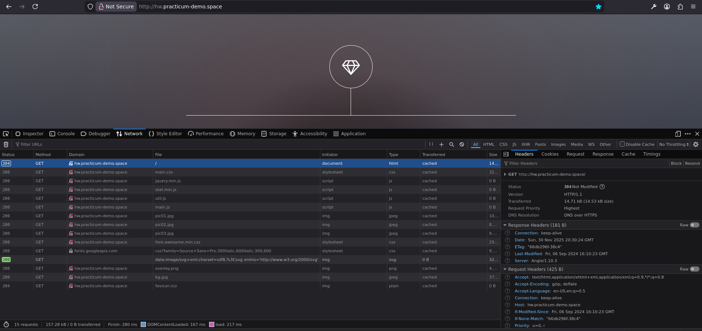
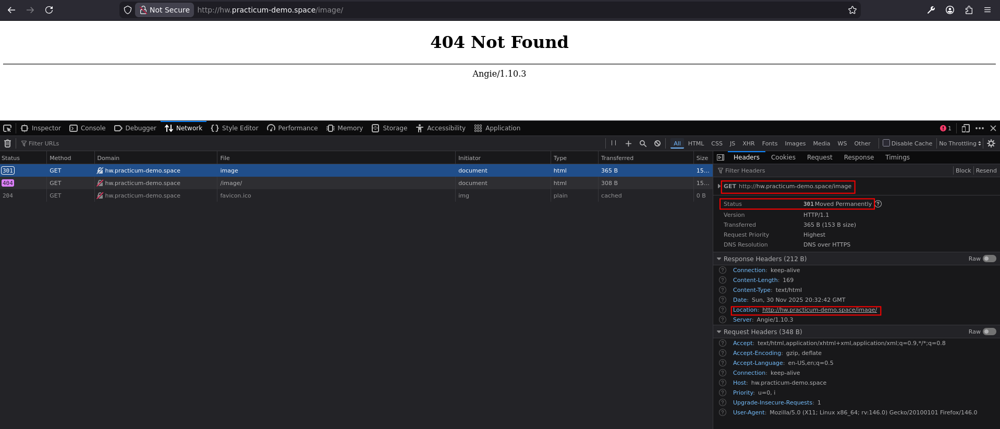

<h2> ДЗ по теме № 05 - Angie как веб-сервер </h2>

 

<h3> 1. Подготовка </h3>

Angie запущен в docker-контейнере от имени непривилегированного пользователя

 
Страница доступна по адресам:

|Назначение|Ссылка|
|:---|:----|
|Основная|http://hw.practicum-demo.space|
|Проверка редиректа| http://test.practicum-demo.space|

 

<h3> 2. Выполненная работа </h3>

Редирект с test.* на hw.*  

 

Открытая страница hw.* в веб-браузере  

 

Перенаправление с /images на /images/  
Ошибка 404 связана с отсутствующим index.html (если нет index файла - возвращаем 404 вместо 403)  

 
