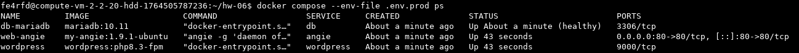

<h2> ДЗ по теме № 06 - Обратный прокси </h2>

<br>

Для приложения использовались следующие образы:  

| Компонент  | Образ     | Версия       |
|:-----------|:----------|:-------------|
| СУБД MySQL | mariadb   | 10.11        |
| Wordpress  | wordpress | php8.3-fpm   |
| Веб-сервер | angie     | 1.9.1-ubuntu |
<br>

Файлы для запуска приложения расположены в [solution/docker](solution/docker)  

Запуск возможен в 2 разных окружениях: ```dev``` и ```prod```  

Для запуска на ПРОД используется команда  
```docker-compose --env-file .env.prod up -d```  

Запущенные контейнеры  


<br>

Страница доступна по адресу:  
http://hw.practicum-demo.space/
