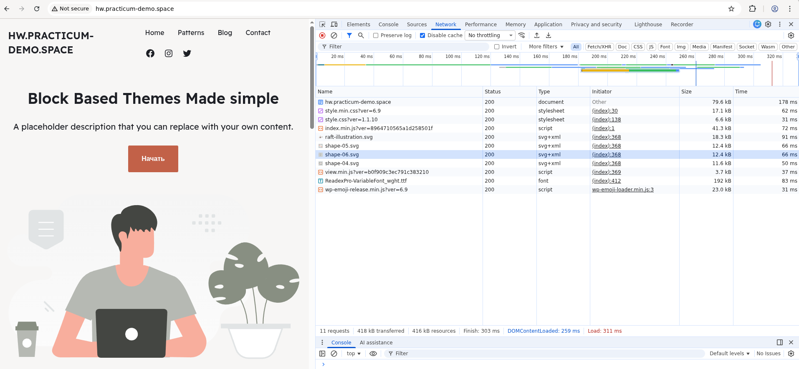
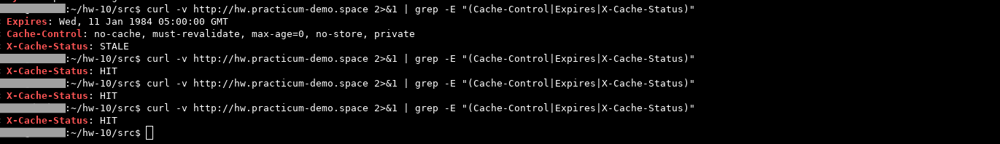
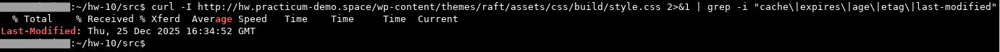
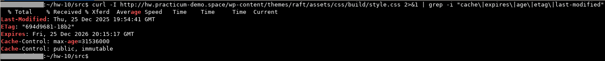
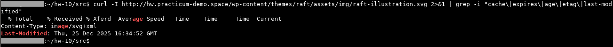
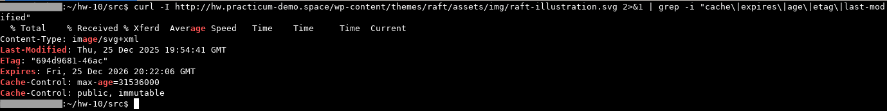
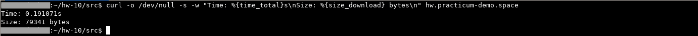

<h2> ДЗ по теме № 10 - Оптимизация производительности веб-сервисов </h2>

<br>

<h3> Предварительные настройки </h3>

<h4> Для приложения использовались следующие образы: </h4>

| Компонент  | Образ     | Версия       |
|:-----------|:----------|:-------------|
| СУБД MySQL | mariadb   | 10.11        |
| Wordpress  | wordpress | php8.3-fpm   |
| Веб-сервер | angie     | 1.10.3-ubuntu |
<br>

<h4> Выполненные работы: </h4>

1. Поднято приложение, с настройкой Angie без оптимизации.  
2. Проведены проверки (из домашней сети учащегося), с фиксацией результатов.  
3. Приложение было остановлено/удалено.
4. Поднято приложение, с настройкой Angie с оптимизацией.  
5. Проведены проверки (из домашней сети учащегося), с фиксацией результатов.  
<br>

<h4> Используемые оптимизации: </h4>

- Кеширование главной страницы (location = /):
    * fastcgi_cache - кеширование ответов PHP-FPM (FastCGI). Кеширует готовый HTML-ответ от WordPress, а не отдельные файлы   
    * заголовок X-Cache-Status  - отслеживание, был ли ответ взят из кеша (HIT) или сгенерирован заново (MISS, BYPASS)  

- Кеширование всех PHP-страниц (location ~ \.php$):
    * fastcgi_cache_background_update  - обновление устаревшего кеша в фоне

- Дополнительно:
    * fastcgi_cache_valid 200 301 302 10m - указание, как долго хранить успешные (200) и редиректные ответы  
    * add_header X-Cache-Status	- заголовок для проверки работы кеша  
    * отключение Gzip и включение Brotli 	 

<br>

<h4> Ссылки: </h4>

Приложение доступно по адресу  ```http://hw.practicum-demo.space```  
(комментарий: тип используемой ВМ - прерываемая, возможна недоступность)

<br>

<h3> Проверки: </h3>

<h4> 1. Панель разработчика в веб-браузере Google Chrome </h4>

До применения оптимизации  
  
<br>

После применения оптимизации  
  
<br>

<h4> 2. Главная страница: проверка заголовков кеша (кеширование через fastcgi) </h4>

Команда  
```curl -v http://hw.practicum-demo.space 2>&1 | grep -E "(Cache-Control|Expires|X-Cache-Status)"```

Результат до:  
  
<br>

Результат после:  
  
<br>

Результат после повторного выполнения команды:    
  
<br>


<h4> 3. Главная страница: проверка поведение кеша </h4>

Команды  
```
curl -s -D - http://hw.practicum-demo.space -o /dev/null | grep -i "x-cache-status"
curl -s -H "Cache-Control: no-cache" -D - http://hw.practicum-demo.space -o /dev/null | grep -i "x-cache-status"
```  

Результат до:  
  
<br>

Результат после:
  
<br>


<h4> 4. Главная страница: проверка сжатия </h4>

Команда  
```curl -H "Accept-Encoding: gzip, br" -I http://hw.practicum-demo.space | grep -i "content-encoding"```  

Результат до:  
  
<br>

Результат после:  
  
<br>


<h4> 5. Проверка заголовков кеширования для файла стиля </h4>

Команда  
```curl -I http://hw.practicum-demo.space/wp-content/themes/raft/assets/css/build/style.css 2>&1 | grep -i "cache\|expires\|age\|etag\|last-modified"```  

Результат до:  
  
<br>

Результат после:  
  
<br>

<h4> 6. Проверка Vary заголовка для файла стиля </h4>

Команда  
```curl -I http://hw.practicum-demo.space/wp-content/themes/raft/assets/css/build/style.css | grep -i "vary"```

Результат до:  
  
<br>

Результат после:  
  
<br>


<h4> 7. Проверка заголовков кеширования для файла изображения </h4>

Команда  
```curl -I http://hw.practicum-demo.space/wp-content/themes/raft/assets/img/raft-illustration.svg 2>&1 | grep -i "cache\|expires\|age\|etag\|last-modified"```  

Результат до:  
  
<br>

Результат после:  
  
<br>


<h4> 8. Проверка скорости загрузки </h4>

Команда  
```curl -o /dev/null -s -w "Time: %{time_total}s\nSize: %{size_download} bytes\n" hw.practicum-demo.space```  

Результат до:  
  
<br>

Результат после:  
  
<br>
