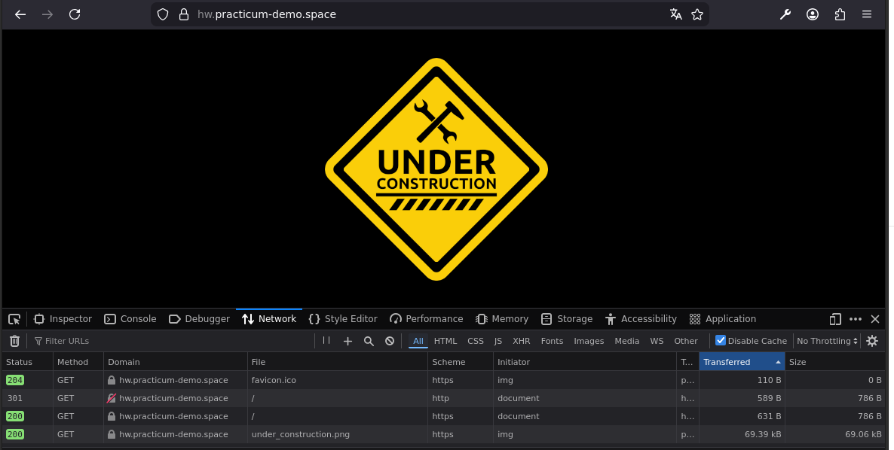
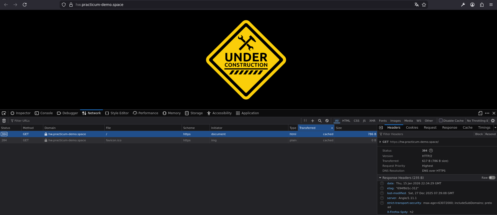
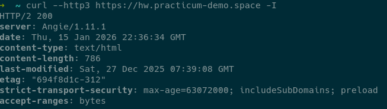

<h2> ДЗ по теме № 14 - Настройка HTTPS для веб-сервисов </h2>

<br>

<h3> Предварительные настройки </h3>

<h4> Angie </h4>

Angie установлен на сервере "пакетным" способом  

Характеристики Angie  
```
Angie version: Angie/1.11.1
nginx version: nginx/1.29.3
built on Tue, 30 Dec 2025 10:47:20 GMT
built with OpenSSL 3.0.13 30 Jan 2024
TLS SNI support enabled
```
<br>


<h4> Certbot </h4>

Certbot установлен через snap.  
Wildcard-сертификат получен в "ручном" режиме для поддоменов *.practicum-demo.space.  

Результат выполнения команды  ```openssl x509 -signature -issuer -subject -startdate -enddate -ext subjectAltName -noout -in /etc/letsencrypt/live/practicum-demo.space/fullchain.pem```  
```
issuer=C = US, O = Let's Encrypt, CN = E8
subject=CN = practicum-demo.space
notBefore=Jan 13 18:17:44 2026 GMT
notAfter=Apr 13 18:17:43 2026 GMT
X509v3 Subject Alternative Name:
DNS:*.practicum-demo.space, DNS:practicum-demo.space
```
<br>

<h3> Проверки: </h3>

Настройка автоматической переадресации с HTTP на HTTPS.  
  
<br>

HTTP/2  
  
<br>

HTTP/3 и заголовок HSTS  
  
<br>

Проверки с внешних сервисов.  

[SSL Labs](https://www.ssllabs.com/ssltest/analyze.html?d=hw.practicum-demo.space)  
  
<br>

<h4> Ссылки: </h4>

Страница доступна по адресу [hw.practicum-demo.space](https://hw.practicum-demo.space)  
(комментарий: тип используемой ВМ - прерываемая, возможна недоступность)  
<br>
