<h2> ДЗ по теме № 16 - Балансировка нагрузки (HTTP) </h2>

<h3> Описание стенда </h3>

Стенд состоит из 6 docker-контейнеров:  

| Имя контейнера | Образ |Назначение |
|:---|:---|:---|
| angie-balance | angie:1.9.1-ubuntu | Проксирование и мониторинг запросов |
| docker-socket-proxy | docker-socket-proxy:v0.4.2 | Проксирование доступа к Docker socket |
| backend1,<br>backend2,<br>backend3,<br>backup | vscoder/webdebugger:latest | Получение запросов |
<br>

<h4>Архитектура</h4>

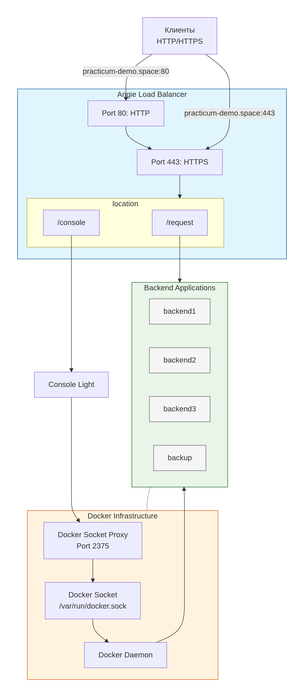  
<br>

<h4> Настройка Angie </h4>

[Конфигурация Angie](solution/src/v_03/docker/angie/conf/prod_angie.conf)  
[Конфигурация виртуальных серверов](solution/src/v_03/docker/angie/conf/virt_servers/prod_hw16.conf)  

Комментарий к конфигурации виртуальных серверов:  
  - переключение метода балансировки производится "в ручную" в мапе
```
map "" $balance_switch {
    default "rr_active";     # Round Robin
    #default "hash_active";   # Hash-based
    #default "random_active"; # Random
}
```
  - запросы поступают на [practicum-demo.space/request](https://practicum-demo.space/request)
  - для мониторинга используется веб-панель "Console Light", панель доступна по [practicum-demo.space/console](https://hw.practicum-demo.space/console). Для входа используется базовая аутентификация по логину и паролю
  - для балансировки round-robin в случае деактивации всех бэкенд-серверов бэкап-сервер начинает принимать запросы и перестает принимать после активации любого из бэкенд-серверов
  - для балансировки по хешу используется переменная $http_user_agent, сервер бэкап отсутствует
  - для произвольной балансировки сервер бэкап отсутствует
  - TLS-сертификат был получен автоматически, с использованием протокола ACME и ALPN-проверки. Краткая информация о ecdsa сертификате:
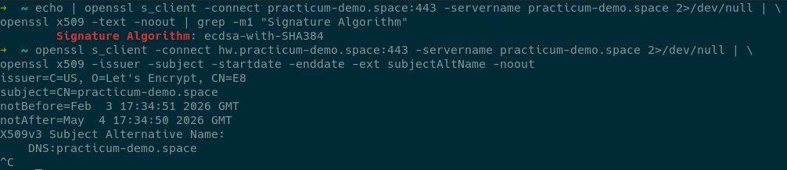  
<br><br>

<h3> Проверки </h3>

<h4> Балансировка "round robin" </h4>

Команда для отправки 30 запросов к балансировщику. Выполняется до и после выключения/включения балансировщика  
```
for i in {1..30}; do \
  echo -n "Request $i: " && \
  curl \
    -H "X-Backend-Server: true" \
    -s -I "https://practicum-demo.space/request" \
    | grep -i "X-Backend-Server" \
    || echo "No backend header"; \
done
```
<br>

3 сервера бэкенда активны (трафик поступает на backend1, backend2 и backend3)  

Результат выполнения команды в терминале  
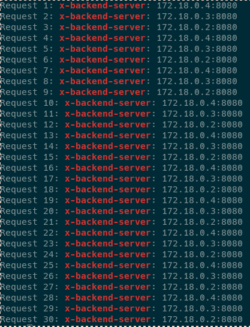  
<br>

Страница мониторинга  
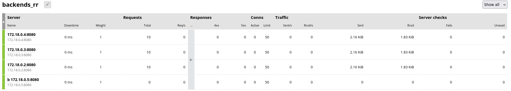  
<br>


Из балансировки выведен backend1 (трафик поступает на backend2 и backend3)  

Результат выполнения команды в терминале  
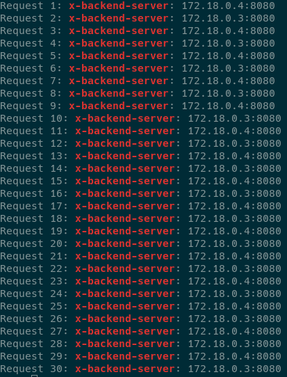  
<br>

Страница мониторинга  
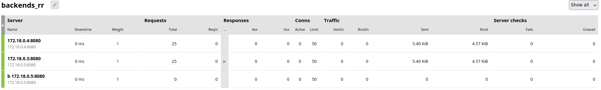  
<br>


Из балансировки выведен backend1 и backend2 (трафик поступает на backend3)  

Результат выполнения команды в терминале  
  
<br>

Страница мониторинга  
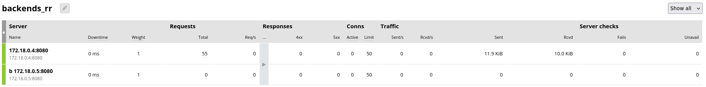  
<br>


Из балансировки выведен backend1, backend2 и backend3 (трафик поступает на backup)  

Результат выполнения команды в терминале  
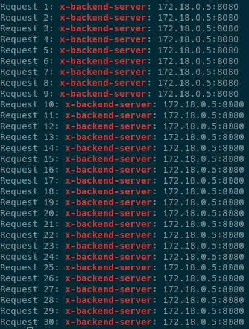  
<br>

Страница мониторинга  
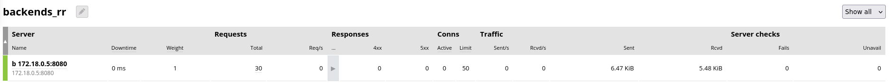  
<br>


В балансировку введен backend1 (трафик поступает на backend1)  

Результат выполнения команды в терминале  
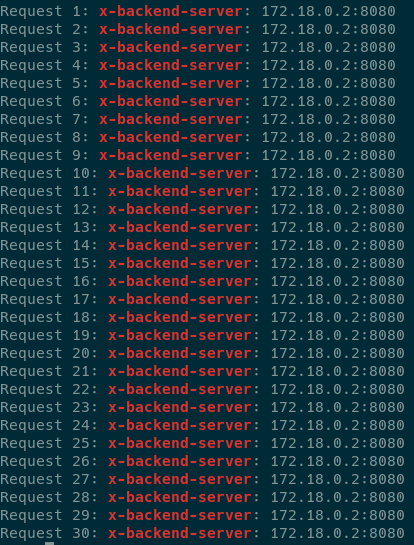  
<br>

Страница мониторинга  
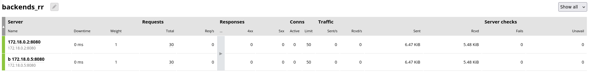  
<br>


В балансировку введены backend1 и backend2 (трафик поступает на backend1, backend2 и backend3)  

Результат выполнения команды в терминале  
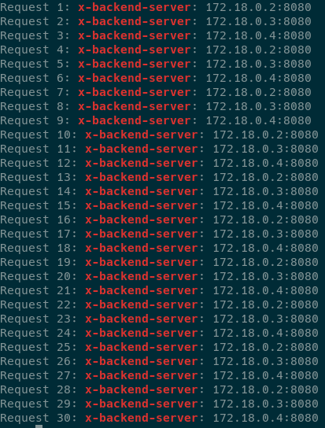  
<br>

Страница мониторинга  
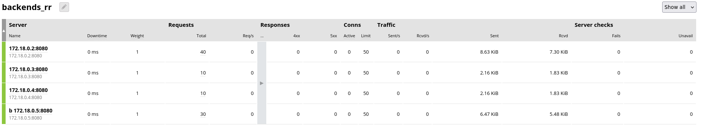  
<br><br>


<h4> Балансировка по хэшу </h4>

bash-скрипт для отправки 60 запросов к балансировщику для разных User-Agent (Chrome, Firefox, Safari)  
```
#!/bin/bash

declare -A stats
for agent in "Chrome/144" "Firefox/135" "Safari/605"; do
  echo "=== User-Agent: $agent ==="
  for i in {1..20}; do
    backend=$(curl -H "User-Agent: $agent" -s -I "https://practicum-demo.space/request" \
      | grep -oP "x-backend-server: \K[^;\s]+")
    [ -z "$backend" ] && backend="unknown"
    echo -n "$backend "
    ((stats["$agent:$backend"]++))
  done
  echo -e "\n"
done

echo "=== Статистика распределения ==="
for key in "${!stats[@]}"; do
  echo "$key: ${stats[$key]} запросов"
done | sort
```

Результат выполнения скрипта в терминале  
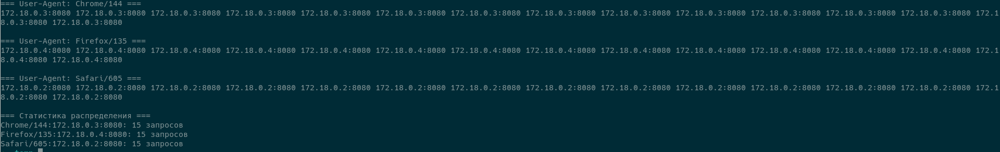  
<br>


Страница мониторинга  
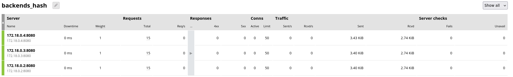  
<br><br>


<h4> Произвольная балансировка </h4>

Команда для отправки 30 запросов к балансировщику.  
```
for i in {1..30}; do \
  echo -n "Request $i: " && \
  curl \
    -H "X-Backend-Server: true" \
    -s -I "https://practicum-demo.space/request" \
    | grep -i "X-Backend-Server" \
    || echo "No backend header"; \
done
```

Результат выполнения команды в терминале  
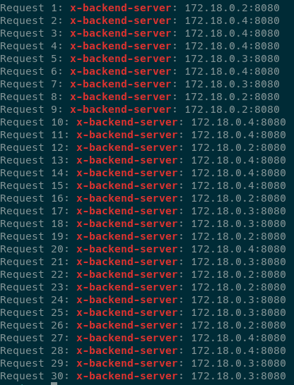  
<br>

Страница мониторинга  
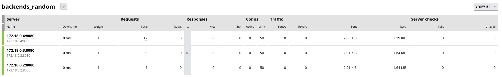  
<br><br>

<h3> Ссылки </h3>

| Описание | Ссылка |
|:---|:---|
| Отправка запросов | [/request](https://practicum-demo.space/request) |
| Мониторинг распределения запросов | [/console](https://hw.practicum-demo.space/console) |

(комментарий: тип используемой ВМ - прерываемая, возможна недоступность)  
<br><br>
