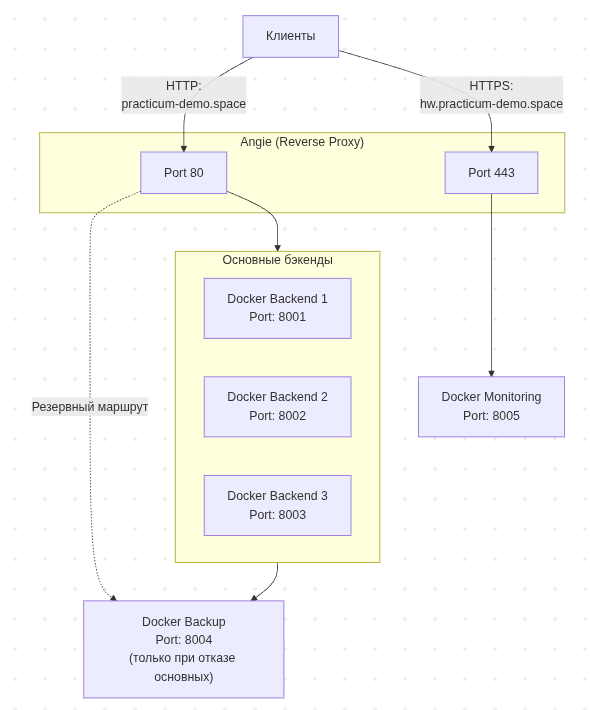
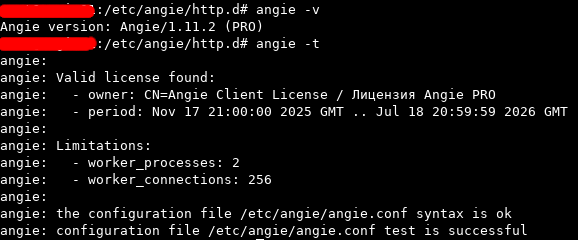
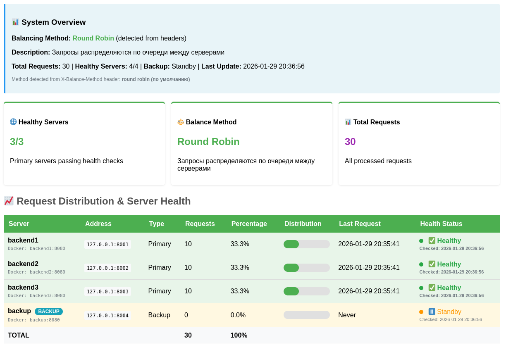
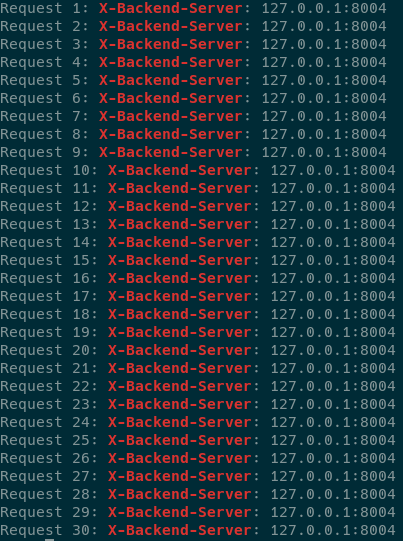
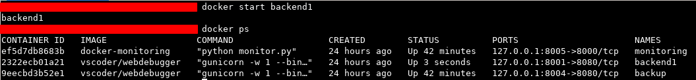
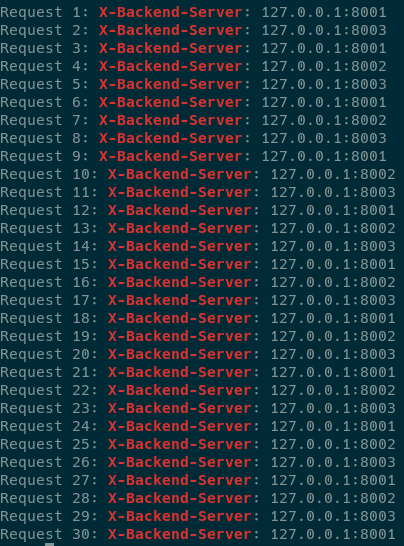
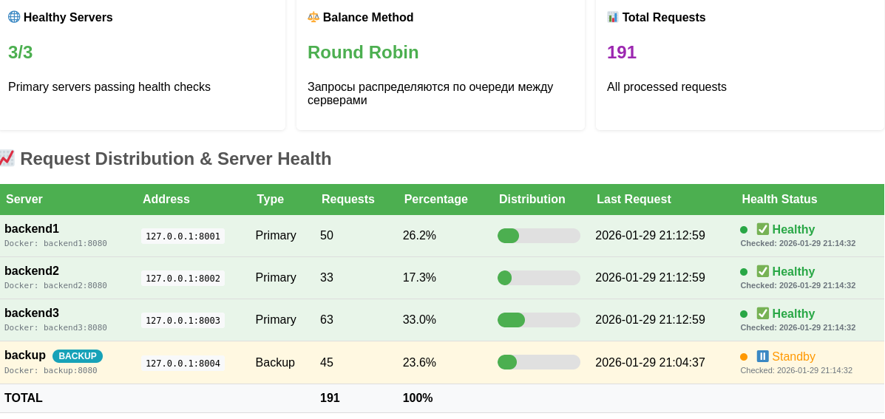
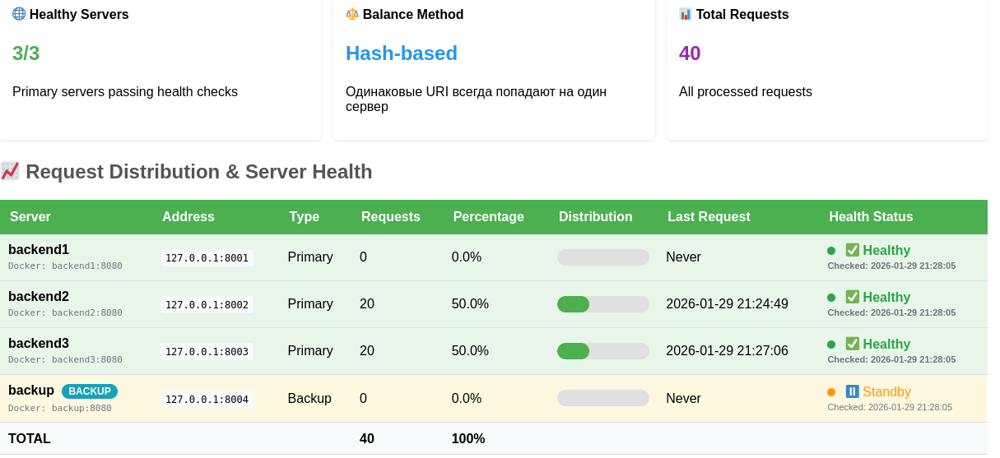
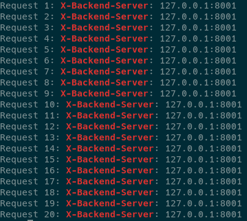
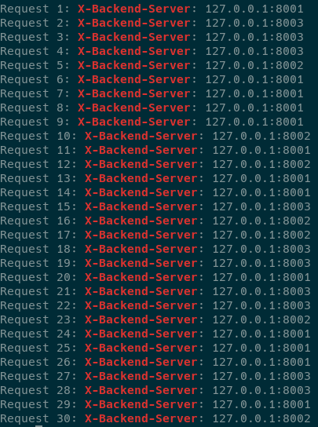

<h2> ДЗ по теме № 16 - Балансировка нагрузки (HTTP) </h2>

<h3> Описание стенда </h3>

Стенд состоит из 1 балансировщика (angie) - установлен на сервере через установщик пакетов,  
и 5 docker-контейнеров: 3 бэкенда, 1 бекап и 1 мониторинг.  

| Имя контейнера | Образ |Назначение |
|:---|:---|:---|
| backend1,<br>backend2,<br>backend3,<br>backup | vscoder/webdebugger:latest | Получение запросов |
| monitoring |python:3.9-slim | Отображение статистики по распределению запросов |
<br>

<h4>Архитектура</h4>

  
<br>


<h4> Настройка Angie </h4>

Установлен Angie PRO с использованием пакетного менеджера.   
Характеристики Angie  
  
<br>


[Конфигурация Angie](solution/src/angie/conf/prod_angie-pro.conf)  
[Конфигурация виртуальных серверов](solution/src/angie/conf/virt_servers/prod_hw16.conf)  

Комментарий к конфигурации виртуальных серверов:  
  - переключение метода балансировки производится "в ручную" в мапе
```
map "" $balance_switch {
    # default "rr_active";     # Round Robin
    default "hash_active";      # Hash-based
    # default "random_active"; # Random
}
```
  - запросы поступают на [practicum-demo.space](http://practicum-demo.space)
  - страница с мониторингом доступна по адресу [hw.practicum-demo.space](https://hw.practicum-demo.space)
  - для балансировки round-robin в случае деактивации всех бэкенд-серверов бэкап-сервер начинает принимать запросы и перестает принимать через 1 минуту, после активации любого из бэкенд-серверов
  - для балансировки по хешу используется переменная $http_user_agent, сервер бэкап отсутствует
  - для произвольной балансировки сервер бэкап отсутствует
  - TLS-сертификат был получен автоматически, с использованием протокола ACME и ALPN-проверки. Краткая информация о ecdsa сертификате:
  
<br><br>

<h3> Проверки </h3>

<h4> Балансировка "round robin" </h4>

Команда для отправки 30 запросов к балансировщику. Выполняется до и после выключения/включения балансировщика  
```
for i in {1..30}; do \
  echo -n "Request $i: " && \
  curl \
    -H "X-Backend-Server: true" \
    -s -I "http://practicum-demo.space/" \
    | grep -i "X-Backend-Server" \
    || echo "No backend header"; \
done
```
<br>

3 сервера бэкенда активны (трафик поступает на backend1, backend2 и backend3)  
Работающие контейнеры  
  
<br>

Результат выполнения команды в терминале  
  
<br>

Мониторинг  
  
<br>


Из балансировки выведен backend1 (трафик поступает на backend2 и backend3)  
Работающие контейнеры  
  
<br>

Результат выполнения команды в терминале  
  
<br>

Мониторинг  
  
<br>


Из балансировки выведен backend1 и backend2 (трафик поступает на backend3)  
Работающие контейнеры  
  
<br>

Результат выполнения команды в терминале  
  
<br>

  
<br>


Из балансировки выведен backend1, backend2 и backend3 (трафик поступает на backup)  
Работающие контейнеры  
  
<br>

Результат выполнения команды в терминале  
  
<br>

  
<br>


В балансировку введен backend1 (трафик поступает на backend1)  
Работающие контейнеры  
  
<br>

Результат выполнения команды в терминале  
  
<br>

  
<br>

3 сервера бэкенда активны (трафик поступает на backend1, backend2 и backend3)  
Работающие контейнеры  
  
<br>

Результат выполнения команды в терминале  
  
<br>

  
<br><br>


<h4> Балансировка по хэшу </h4>

Перед выполнением проверки были сброшены результаты предыдущих проверок на странице мониторинга.  
Команды для отправки 20 запросов к балансировщику  

Для User-Agent: Chrome  
```
for i in {1..20}; do \
  echo -n "Request $i: " && \
  curl \
    -H "User-Agent: Chrome/144.0.0.0" \
    -H "X-Backend-Server: true" \
    -s -I "http://practicum-demo.space/" \
    | grep -i "X-Backend-Server" \
    || echo "No backend header"; \
done
```

Результат выполнения команды в терминале  
  
<br>

Страница мониторинга  
  
<br>

Для User-Agent: Mozilla  
```
for i in {1..20}; do \
  echo -n "Request $i: " && \
  curl \
    -H "User-Agent: Mozilla/5.0" \
    -H "X-Backend-Server: true" \
    -s -I "http://practicum-demo.space/" \
    | grep -i "X-Backend-Server" \
    || echo "No backend header"; \
done
```

Результат выполнения команды в терминале  
  
<br>

Страница мониторинга  
  
<br>

Для User-Agent: Safari  
```
for i in {1..20}; do \
  echo -n "Request $i: " && \
  curl \
    -H "User-Agent: Safari/605.1.15" \
    -H "X-Backend-Server: true" \
    -s -I "http://practicum-demo.space/" \
    | grep -i "X-Backend-Server" \
    || echo "No backend header"; \
done
```

Результат выполнения команды в терминале  
  
<br>

Страница мониторинга  
  
<br><br>


<h4> Произвольная балансировка </h4>

Перед выполнением проверки были сброшены результаты предыдущих проверок на странице мониторинга.  
Команда для отправки 30 запросов к балансировщику.  
```
for i in {1..30}; do \
  echo -n "Request $i: " && \
  curl \
    -H "X-Backend-Server: true" \
    -s -I "http://practicum-demo.space/" \
    | grep -i "X-Backend-Server" \
    || echo "No backend header"; \
done
```

Результат выполнения команды в терминале  
  
<br>

Страница мониторинга  
  
<br><br>

<h3> Ссылки </h3>

| Описание | Адрес |
|:---|:---|
| Отправка запросов | [practicum-demo.space](http://practicum-demo.space) |
| Мониторинг распределения запросов | [hw.practicum-demo.space](https://hw.practicum-demo.space) |

(комментарий: тип используемой ВМ - прерываемая, возможна недоступность)  
<br><br>
