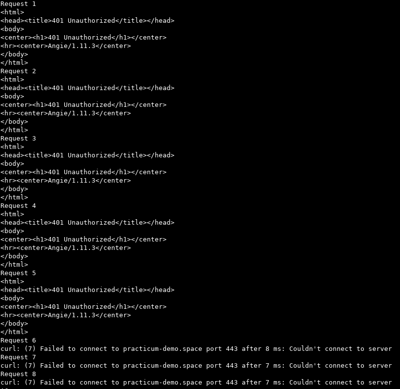
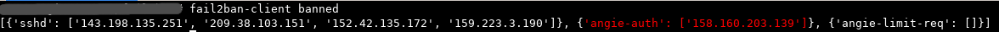
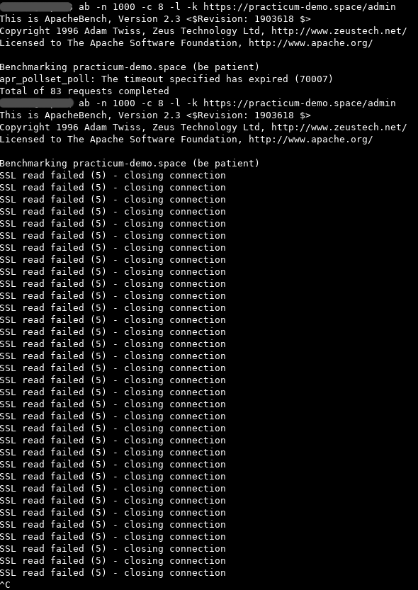
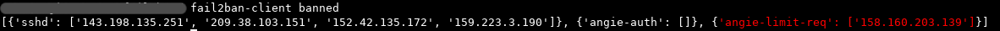

<h2> ДЗ по теме № 21 - Защита от DoS-атак, ограничение доступа </h2>

<h3> Предварительные настройки </h3>

<h4> Angie </h4>

Angie установлен на сервере "пакетным" способом  

Характеристики Angie  
```
Angie version: Angie/1.11.3 (PRO)
nginx version: nginx/1.29.3
built on Fri, 06 Feb 2026 11:27:01 GMT
built with OpenSSL 3.0.13 30 Jan 2024
TLS SNI support enabled
```

Для проверок были настроены следующие ендпоинты с базовой аутентификацией по логину и паролю

| Имя | Назначение |
|:---|:---|
| /auth | Указывает на дефолтную страницу-заглушку Angie |
| /actuator | Указывает на дефолтную страницу-заглушку Angie |
| /admin | Указывает на дефолтную страницу-заглушку Angie |
| /wp-admin | Указывает на дефолтную страницу-заглушку Angie |
| /console | Указывает на "Angie Console Light" |
<br>

<h4> Fail2ban </h4>

Fail2ban установлен на сервере "пакетным" способом  

Версия Fail2ban  
```
1.0.2
```

Для Angie настроены следующие джейлы  

| Имя | Назначение | 
|:---|:---|
| angie-auth | Для обнаружения и блокирования bruteforce-атак на базовую аутентификацию |
| angie-limit-req | Для ограничения частоты запросов |
<br>

<h3> Проверки </h3>

Для отправки тестовых запросов также поднята ВМ в Yandex.Cloud  

1. Проверка аутентификации  
Используемая команда  
```
for i in {1..100}; do
  echo "Request $i"
  curl -u wrong:password https://practicum-demo.space/wp-admin
  sleep 2
done
```

Результат выполнения тестовых запросов  
  
<br>

Проверка банов на сервере  
  
<br><br>


2. Проверка лимитирования количества запросов  
   Используемая команда
```
ab -n 1000 -c 8 -l -k https://practicum-demo.space/admin
```

Результат выполнения тестовых запросов  
  
<br>

Проверка банов на сервере  
  
<br><br>
